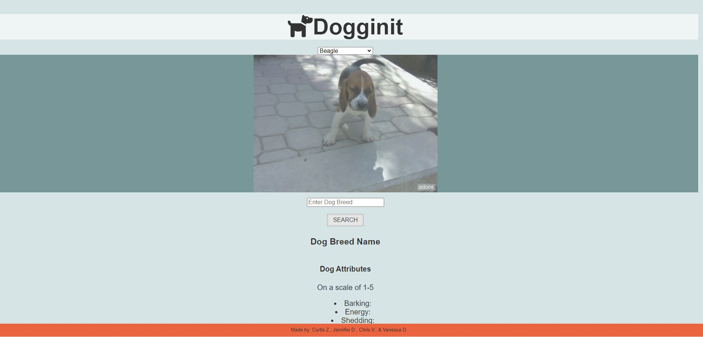
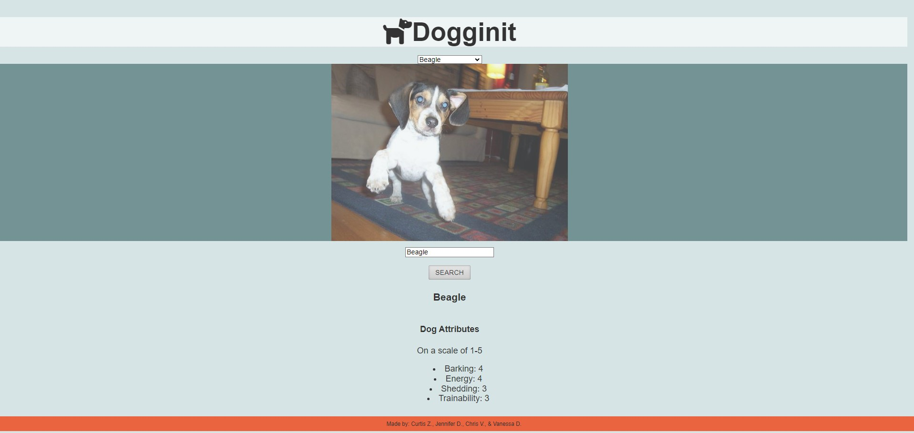

# dogg-init-project

## Description

In this project, users are able to pick a dog breed of their choice from the drop down menu that will then show a slideshow of images of that particular breed. To further get more information about the dog breed, the user can type the dog breed that they chosen from the previous list and click "SEARCH" where they can view the list of attributes of the dog breed. The list of attributes that are displayed is barking, energy, shedding, and trainability which are rated on a scale of 1-5. 

This project was created for anyone who wants to find more information about different dog breeds as well as their list of attributes to gain a better understanding of the types of dogs they are looking for if they decide to adopt in the future. 

## Installation

N/A

## Usage

The application can be viewed via [GitHubPages](https://github.com/jxdang1/dogg-init-project)

Users will start by clicking on the drop down button "Choose a dog" that will prompt them with different dog breeds. This will give them a slideshow of images of that specific dog breed. 

Users will then write the same dog breed in the search bar down "Enter dog breed" below to get the attributes of the dog breed on the scale of 1-5 (barking, energy, shedding, and trainability)

## Credits

[The Dog API](https://dog.ceo/dog-api/)

[API Ninjas](https://api-ninjas.com/api/dogs)

## Contributors

Jennifer Dang, Vanessa Dusin, Curtis Zahniser, Christopher Villegas

## License

Please see license in github repo

